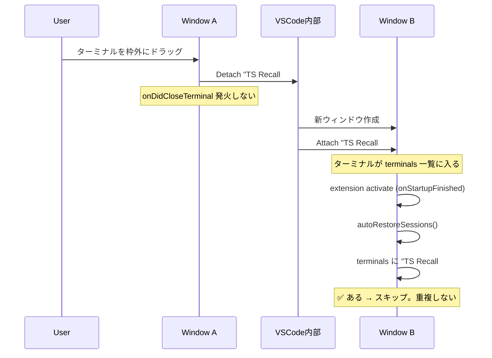

# セッション重複バグ: マルチウィンドウ対策 (#46)

## 問題

ターミナルタブを VSCode 枠外にドラッグすると live カウントが増え、再起動で同名セッションが 2 つ復元される。

## 根本原因（調査済み → [Issue #46 コメント](https://github.com/orangewk/terminal-session-recall/issues/46#issuecomment-4016578308)）

ドラッグ操作は内部的に **Terminal: Detach Session → Attach to Session** と同等。

1. Detach 時に `onDidCloseTerminal` が発火しない（[microsoft/vscode#152785](https://github.com/microsoft/vscode/issues/152785)）
2. セッションが `active` のまま globalState に残る
3. 新ウィンドウで extension activate → `autoRestoreSessions` が同じセッションを復元
4. 元ターミナルも attach で新ウィンドウに到着 → **同一セッションのターミナルが 2 つ**

## タイミング分析

> 図は VSCode の Markdown Preview で閲覧すること（Mermaid レンダリングが必要）。
> GitHub Issue にも同じ図を転記済み: [#46 comment](https://github.com/orangewk/terminal-session-recall/issues/46#issuecomment-4016583537)

修正の効果は **attach と extension activate の実行順序** に依存する。

### attach が先に完了する場合 → 修正が効く



### 順序の根拠

VSCode の起動シーケンス（[Issue #193623](https://github.com/microsoft/vscode/issues/193623)、[startup profiling data](https://github.com/microsoft/vscode/issues/214008)）:

1. **Workbench 初期化** — ターミナルの reconnect/attach はここで処理される（`willReconnect` → `didReconnect`）
2. **`*` activated 拡張の activate**
3. **`onStartupFinished` 発火** — 本拡張はここで activate

ターミナルの attach は workbench レベル、拡張の activate はその後。**attach が先であることは VSCode の設計上保証されている。**

## 修正内容

### `autoRestoreSessions` に既存ターミナルチェックを追加

復元ループの各セッションについて、`vscode.window.terminals` に同じ `terminalName` が既に存在すればスキップする。

```typescript
const alreadyExists = vscode.window.terminals.some(
  (t) => t.name === mapping.terminalName,
);
if (alreadyExists) continue;
```

**なぜこれで十分か:**
- Detach → Attach でターミナルが新ウィンドウに移動すると、`vscode.window.terminals` にそのターミナルが存在する
- `onStartupFinished` は attach 完了後に発火するため、チェック時点でターミナルは必ず一覧にいる
- 存在チェックは決定的（タイミングに依存しない）
- 遅延・refresh・IPC 不要

## 影響範囲

- `src/extension.ts` — `autoRestoreSessions` に 3 行追加

## 複雑度: 低
