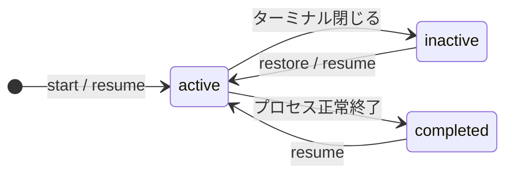
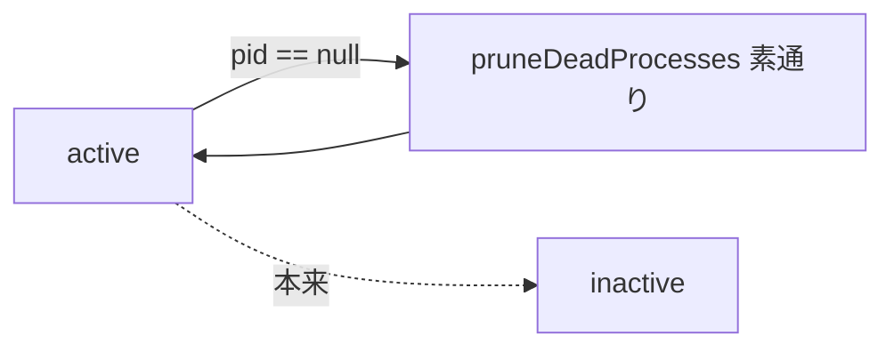
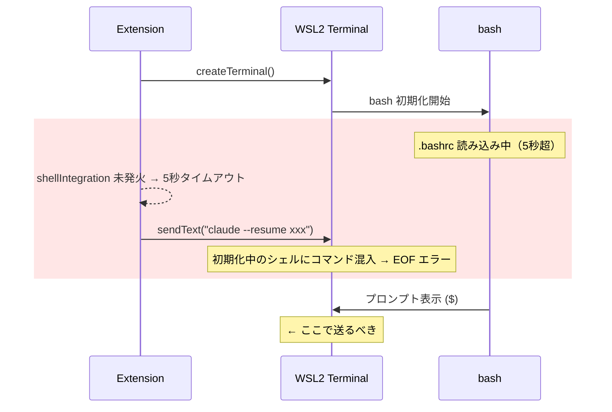
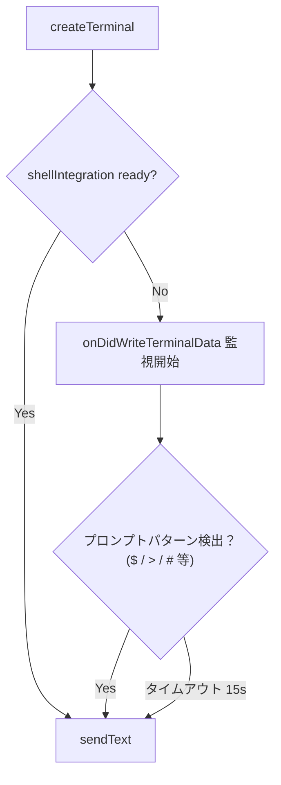
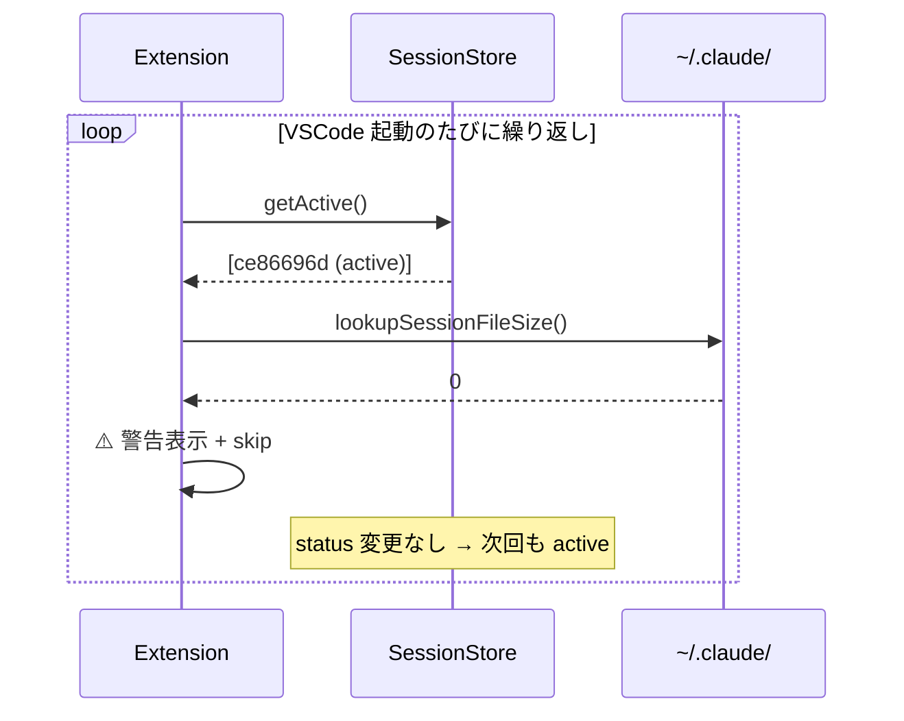

# WSL2 環境バグ報告 3件（#62 #63 #64）

2026-03-16 にユーザーから WSL2 環境で 3 件のバグ報告あり。
いずれもセッション状態遷移の不備に起因する。

## セッション状態遷移（正常系）



---

## #62 — Activeセッションが残り続ける

**Issue**: https://github.com/orangewk/terminal-session-recall/issues/62

### 現象

ターミナルが存在しないのにステータスバーに `TS Recall: N live` と表示される。

### 原因

`pruneDeadProcesses()` は PID 記録済みのセッションのみチェックする（`session-store.ts:189`）。
以下のケースで active が残る：

- PID 未記録（`upsert` 前にクラッシュ）
- `isProcessAlive` が `undefined` を返す（判定不能）



### 修正方針

QuickPick に「Reset stale sessions」アクションを追加。
`vscode.window.terminals` の名前リストと照合し、対応ターミナルが存在しない active セッションを inactive に変更する。

### 変更箇所

| ファイル | 変更内容 |
|---------|---------|
| `extension.ts` | QuickPick に Reset アクション追加 |
| `session-store.ts` | `resetStale(projectPath, liveTerminalNames)` メソッド追加 |

---

## #63 — WSL2 で sendText が早すぎて EOF エラー

**Issue**: https://github.com/orangewk/terminal-session-recall/issues/63

前回修正: [2026-03-14-wsl2-sendtext-race.md](2026-03-14-wsl2-sendtext-race.md)（v1.0.5）

### 現象

```
/bin/bash: -c: line 1: unexpected EOF while looking for matching `'
[プロセスはコード 2 (0x00000002) で終了しました]
```

### 原因

v1.0.5 の `sendTextWhenReady()` はシェル統合 API を待つが、WSL2 ではシェル統合が発火しない場合がある。
5 秒タイムアウト後のフォールバック `sendText` でも、WSL2 の distro 起動が 5 秒を超えるとコマンドが早すぎる。



### 修正方針

`onDidWriteTerminalData` でターミナルの出力を監視し、プロンプト文字を検出してから送信する。



シェル統合 → ターミナル出力検出 → タイムアウトの 3 段フォールバック。

### 変更箇所

| ファイル | 変更内容 |
|---------|---------|
| `extension.ts` | `sendTextWhenReady()` にターミナル出力監視フォールバックを追加 |

---

## #64 — conversation data なしセッションが active のまま残る

**Issue**: https://github.com/orangewk/terminal-session-recall/issues/64

### 現象

```
Terminal Session Recall: Session ce86696d has no conversation data. Skipping.
```

VSCode 起動のたびに同じ警告が表示される。

### 原因

`resumeSession()` でファイルサイズ 0 を検出して skip するが、status を変更しない。
active のまま残るため、次回の `autoRestoreSessions()` で再度対象になり同じ警告が出る。



### 修正方針

skip 時に `markInactiveBySessionId()` を呼ぶ。1 行追加。

```typescript
// extension.ts:211-216
if (lookupSessionFileSize(projectPath, sessionId) === 0) {
  vscode.window.showWarningMessage(
    `Terminal Session Recall: Session ${sessionId.slice(0, 8)} has no conversation data. Skipping.`,
  );
  await store.markInactiveBySessionId(sessionId, projectPath);  // ← 追加
  return;
}
```

### 変更箇所

| ファイル | 変更内容 |
|---------|---------|
| `extension.ts` | `resumeSession()` の skip 時に `markInactiveBySessionId` 追加 |

---

## 修正優先度

| 優先度 | Issue | 理由 |
|:---:|-------|------|
| 1 | #64 | 1 行で修正可能。毎回警告が出るため UX 影響大 |
| 2 | #62 | 状態リセット機能。#64 と組み合わせで状態不整合の包括対策 |
| 3 | #63 | WSL2 固有。シェル統合の代替検出ロジックが必要で実装量が多い |
